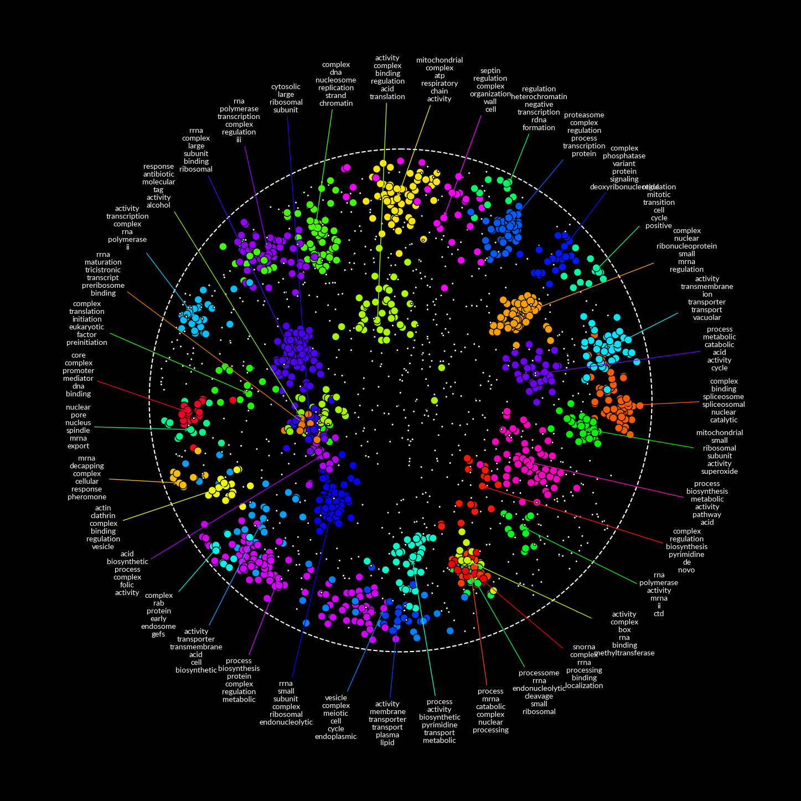

# RISK

<ins>Regional Inference of Significant Kinships</ins>

    
    

RISK is a software tool for visualizing spatial relationships in networks. It aims to enhance network analysis by integrating advanced network annotation algorithms, such as Louvain and Markov Clustering, to identify key functional modules and pathways.

## Features

- Spatial analysis of biological networks
- Functional enrichment detection
- Optimized performance

## Example

*Saccharomyces cerevisiae* proteins oriented by physical interactions discovered through affinity enrichment and mass spectrometry (Michaelis et al., 2023).

## Installation

Coming soon...

## Usage

Coming soon...

## License

This project is licensed under the GPL-3.0 license.
